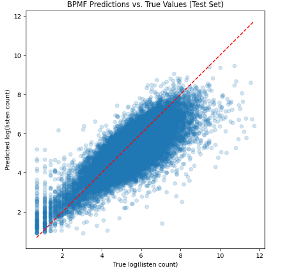

## Team GANGgsters

**Zoe Calianos**, **Apoorva Gupta**, **Peyton Nash**, **Kirthi Rao**

---

## Problem Statement

A person’s taste in movies, television, visual art, and music is difficult to pin down. When Amazon Studios’ production slate failed to garner the audience executives hoped for, Jeff Bezos created a list of twelve characteristics shared by all “iconic” shows. However, it is not difficult to find counterexamples for every item. While a formula for good art remains elusive, streaming services of all kinds face a similar issue: how to use their vast stores of data to make personalized recommendations to their users.

We focus on making **music recommendations**. The traditional “record store” approach learns individual users’ listening habits and identifies artists, albums, or songs that are similar. However, this method has several limitations:

- **User preference understanding:** Why does a user like a particular piece of music?  
- **Content analysis complexity:** Computers struggle to “understand” music at a deep level.  
- **Computational cost:** Calculating similarities for millions of users and items can be prohibitive.

Instead, machine learning approaches often use **collaborative filtering**, which identifies recommendations based on patterns in all users’ listening habits.

Our project considers **Markov chain Monte Carlo (MCMC)** and **Automatic Differentiation Variational Inference** to perform **Bayesian Probabilistic Matrix Factorization (BPMF)**, allowing us to predict how many times a user is likely to listen to an artist.

---

## Previous Work / Approaches

- **Collaborative filtering** and **content-based filtering** using similarity scores over a user–item matrix have been the most common approaches.  
  - Popular similarity metrics include cosine, Jaccard, and Pearson scores.
- We believe a **Bayesian approach** will:
  1. Capture low-level latent dimensions in the data  
  2. Provide stronger regularization through Gaussian priors

---

## Data Used

We will be using the publicly available **Last.fm dataset**, which contains over **1 million** user–song listening records.  
   
- **Dataset link:**  
  [HetRec 2011 — Last.fm Dataset (GroupLens)](https://grouplens.org/datasets/hetrec-2011/)

---

## EDA, Data Preprocessing, and Cleaning

The team tried a variety of data preprocessing methods to extract the most informative features while managing computational resources. Team members created user-item matrices. Some models were developed on a subsample of 100 artists and 100 users from a matrix. Others were run on a virtual machine through Google Cloud Platform (GCP) and included the full data. Team members tested raw, log-transformed, and standardized data. The team split the data into training and testing sets for modeling.

---

## Modeling Approaches Considered

1. **Bayesian Probabilistic Matrix Factorization (BPMF)**  
   - Learns latent user and item factors from observed listening counts  
   - Places Gaussian / Negative Binomial priors on these factors for regularization
   - Team experimented with:
      - Different likelihood functions (Gaussian, Negative Binomial)
      - Hyperparameter tuning (sigma values, latent dimension size)
      - Hierarchical priors to improve generalization and model structure
     
Because BPMF operates directly on observed listening data with Bayesian priors, no pretrained models are necessary. We implemented BPMF using **PyMC**.
   
2. **MCMC for Posterior Inference**
   - MCMC uses No-U-Turn-Sampler (NUTS) for efficient exploration
   - Samples from the posterior distribution of the latent factors  
   - Generates uncertainty-aware, personalized recommendations via posterior predictive distributions
   - Generates samples that reflect the true posterior distribution, but is computationally expensive
   
3. **ADVI for Posterior Inference**
   - Alternative to MCMC that approximates the posterior using optimization
   - Faster and more scalable, good for large datasets
   - Uses a multivariate Gaussian to approximate the posterior

---

## Model Used

In the final model, we employ BPMF with 5 latent dimensions (k=5). The model takes the user factors (U) and the item factors (V) as multivariate normal distributions with the shared priors mu_u, mu_v, sigma_u, and sigma_v, and models the predicted rating as the dot product of U and V. The likelihood is set as Gaussian. More detail on the parameters is given below:
- U is the latent factor matrix for users, drawn from a normal distribution with mean mu_u and standard deviation sigma_u
- V is the latent factor matrix from artists, drawn from a normal distribution with mean mu_v and standard deviation sigma_v
- mu_u and mu_v are the means for the user and item (artist) latent factors
- sigma_u and sigma_v are the standard deviations for the user and item latent factors, drawn from a half-normal distribution
- sigma is the standard deviation of observation noise learned from the data
- R_obs is the likelihood

We use Automatic Differentiation Variational Inference (ADVI) to approximate the posterior distribution. ADVI uses stochastic optimization to approximate the model's true posterior distribution by minimizing the difference (KL divergence) between the approximate and true posterior. We ran 20,000 iterations of the optimization process `(n=20000)` and used a posterior trace of 1,000 `(trace=approx.sample(1000))`. The trace value generates plausible sets of parameter values from the learned distribution. These samples allow us to quantify the uncertainty in our predictions. 

### Variational Inference

In use cases where the posterior is intractable, Markov chain Monte Carlo are the most accurate way to estimate the posterior: when performed correctly, MCMC methods converge to the actual posterior distribution. However, they are relatively expensive computationally and do not scale well to large data. [ADD COMPLEXITY HERE] Variational inference is a faster and more scalable alternative. Where MCMC methods sample from the posterior, variational inference seeks to approximate the posterior using a surrogate distribution that is easier to sample from. That is, when the posterior $p(z|D)$ is intractable, variational inference seeks to find some $q(z)\approx p(z|D)$ using the KL divergence as the loss metric:

$$q^{*}(z) = \text{argmin}_{q(z)\in Q}(\text{KL}(q(z) || p(z|D))$$

where $Q$ is a family of 'simple' distributions of the same dimension as $p(z|D)$. However, straight variational inference requires model-specific derivations of the optimization problem that can be complex and time-consuming to arrive at.

### Automatic Differentiation Variational Inference (ADVI)

ADVI avoids the model-specific derivations by utilizing automatic differentiation to compute the gradient of the loss function. While it is faster than MCMC methods, ADVI has its own limitations, namely that it assumes zero correlation between the distributions and relaxing this assumption is itself quite expensive computationally.

---

## Results

Our error metrics are in logged units because we log-transformed play counts in pre-processing. The Root Mean Squared Error (RMSE) of our model was 0.92. This indicates that our predictions differ from the true log play count by 0.92. The Mean Squared Error (MSE) was 0.69, which reflects the absolute deviation in log units between the true values and predicted values. The R2 of our model was 0.62, which tells us that 62% of the variance in the test set is explained by the model. We consider these results strong given the size and complexity of our dataset. 

---

## Challenges
**Limited Data per User:** 
50 artists per user is not a lot, especially since the total number of artists is large. This can make learning strong user preferences difficult, especially for users with unique tastes.

**Sparse Global Matrix:** 
Even though each user has 50 artists, the user-artist matrix is still sparse (most user-artist pairs are missing).

**Cold Start Artists:** 
Artists that only appear for a handful of users will have poorly estimated latent factors, which can lead to odd recommendations, such as in cases listed below:

- If an artist is rare but appears in a user's list, the model may overfit to that artist’s latent factors.

- Since user overlap is low (few shared artists among users), the model struggles to generalize user preferences.

- When the overlap is high, popular artists may dominate recommendations.

## Future Work

**1. Expand Listening Data**  
Acquire more artist listening data per user to improve preference modeling beyond the current 50-artist limitation.

**2. Incorporate Complete Metadata**  
Acquire missing artist genre and user tag data to enable hybrid recommendation approaches.

**3. Address Data Sparsity** 
Investigate methods to mitigate the effects of data sparsity, such as content-based filtering with metadata.

**4. Temporal Component Integration** 
Ideally, our training data would include **precise timestamps** for every listen event so we could model not only what users like, but **how their tastes evolve over time**. With time‑stamped histories, we would be able to:

- **Capture discovery patterns** (e.g., how listening to Artist A in March led to exploring Genre B in June)  
- Ensure our train/test split respects **chronology**, avoiding data leakage  
- Surface genuinely novel, timely recommendations  

In our current “holistic” setup, we lose ordering information, risking:

- Recommending tracks a user already heard months ago  
- Training on future listens and “predicting” them in the past  

Incorporating **temporal dynamics** will eliminate these issues and improve recommendation quality.
